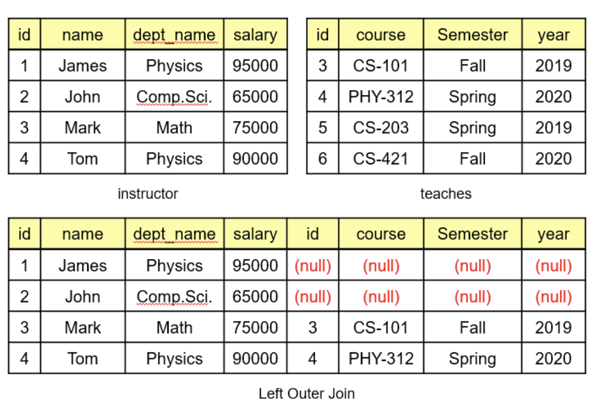

# equals()와 hashcode()

모든 클래스는 Object 클래스를 구현하고 있으며,

Object 클래스는 내부적으로 equals()와 hashcode()를 포함한다.

## equals()

기본적으로 Object 클래스의 equals()는 메모리 주소값을 비교하는 동일성 체크만 한다.

그러나 우리는 메모리가 다르더라도 같은 값을 가지고 있는 객체를 같은 객체라고 판단하고 싶을 때가 있다.

<pre class="language-java"><code class="lang-java"><strong>public class Person {
</strong><strong>    final String name;
</strong><strong>    
</strong><strong>    public Person (String name) {
</strong><strong>        this.name = name;
</strong><strong>    }
</strong><strong>}
</strong><strong>
</strong><strong>
</strong><strong>Person personA = new Person("상준")
</strong><strong>Person personB = new Person("상준")
</strong><strong>
</strong><strong>System.out.println(personA.equals(personB)) // false
</strong></code></pre>

위에서 personA와 personB를 equals()한 결과값은 false이다.

이유는 Object 클래스가 가지고 있는 기본적인 equals()는 다음과 같이 구현되어 있다.

```java
 public boolean equals(Object obj) {
        return (this == obj);
}
    
```

\==을 사용하면 단순히 메모리 값으로 비교를 하기 때문에, 기본적인 equals()는 동일성만을 체크하는 것을 알 수 있다.

그렇기 때문에 "상준"이라는 이름을 가진 Person 객체를 이름이 같으면 주소가 다르더라도 같은 객체로 판단하도록 하고 싶은 경우, equals()를 재정의 해야하는 것이다.

```java
@Override
public boolean equals(Object o) {
    if (this == o) return true;
    if (o == null || o.getClass() != this.getClass()) return false;
    
    return this.name.equals(((Person)o).name)
}
```

위처럼 이름이 같은지 여부로 반환하기 때문에 이름이 같으면 같은 객체임을 판단하게 된다.

그런데 결국 name의 equals()를 사용하고 있는데, String 타입의 equals()가 어떻게 구현되어 있는지 확인해보자.

```java
public boolean equals(Object anObject) {
        if (this == anObject) {
            return true;
        }
        return (anObject instanceof String aString)
                && (!COMPACT_STRINGS || this.coder == aString.coder)
                && StringLatin1.equals(value, aString.value);
}
```

String 타입은 실제 값을 이용해서 동등성을 판단하기 때문에 메모리 주소가 다르더라도 같은 객체로 간주한다.

이제 Person 클래스는 이름이 같으면 같은 객체로 간주된다.

## hashCode()

hashCode()는 메모리 주소값을 변환해서 정수를 반환해준다.

이제 hashCode()를 사용하는 HashSet에 위에서 만든 personA와 personB를 넣어보자.

우리는 equals()를 재정의해서 이름이 같으면 같은 객체인 것으로 만들었으니, HashSet에 두 객체를 넣으면 size()가 1임을 기대했다.

```java
Set<Person> set = new HashSet<>(Arrays.asList(personA,personB);
System.out.println(set.size()); // 2
System.out.println(personA.hashCode()); // 10110...
System.out.println(personB.hashCode()); // 14235...
```

그러나 해시 셋의 크기는 2에, 각 Person 객체의 해시코드가 달랐다.

hashcode()를 사용하는 컬렉션에서 객체의 같음을 판단하는 기준이 다음과 같기 때문이다.

<figure><figcaption></figcaption></figure>

즉, hashCode()의 반환 값이 다르기 때문에 다른 객체로 판단해버리는 것이다.

재정의하지 않았기 때문에 컬렉션에서는 Object 클래스의 hashCode()를 사용하기 때문에 다른 객체로 판단되어지는 것이다.

이제 재정의를 해보자.

```java
@Override
public int hashCode() {
    return name != null ? name.hashCode(): 0;
}
```

이제 personA와 personB는 같은 hashCode를 반환한다.


코틀린에서는 === 가 자바의 ==, 즉 메모리 주소값 비교를 한다.

그리고 코틀린의 ==는 내부적으로 equals()를 사용한다.

