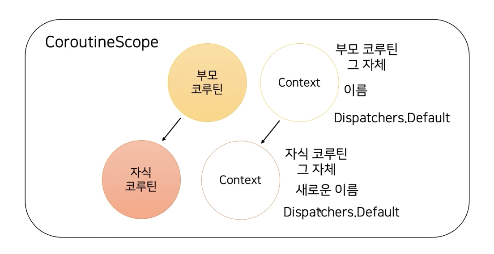

# JOIN에 대해서

<figure><figcaption></figcaption></figure>

SQL에서 가장 중요한 문법 중 하나로, 서로 다른 두 테이블로부터 결과를 조합해서 볼 수 있다.

크게 다음과 같이 나누어진다.

* INNER JOIN
* LEFT (OUTER) JOIN
* RIGHT (OUTER) JOIN
* FULL JOIN

상기 명칭에서 LEFT와 RIGHT는 드라이빙 테이블을 생각하면 편하다.

JOIN 연산은 두 테이블을 조합하는 것이기 떄문에 조건문이 필수이며, ON 절을 통해 조건을 추가하면 된다.

## INNER JOIN - 내부 조인

두 테이블에서 JOIN 조건 컬럼이 모두 값이 존재해야한다.

<figure><figcaption></figcaption></figure>

예를 들어, CITY와 STATION이라는 테이블에서 CITYCODE라는 컬럼을 기준으로 INNER JOIN SQL문은 다음과 같이 작성한다.

```sql
SELECT Sales.*, Countries.Country
FROM Sales
JOIN Countries
ON Sales.CountryID = Countries.ID
```

## LEFT OUTER JOIN

왼쪽 테이블을 기준으로 일치하는 행만 결합되고, 일치하지 않는 행은 NULL로 채워진다.

<figure><figcaption></figcaption></figure>

SQL문은 다음과 같이 작성할 수 있다.

```sql
SELECT intructor.*, teaches.*
FROM instructor
LEFT JOIN teaches
ON instructor.id = teaches.id;
```

## RIGHT OUTER JOIN

이번엔 오른쪽 테이블을 기준으로, 오른쪽 테이블의 조건 컬럼과 일치하는 레코드가 없을 경우 NULL로 채워진다.

<figure><figcaption></figcaption></figure>

```sql
SELECT instructor.*, teaches.*
FROM instructor
RIGHT OUTER JOIN teaches
ON instuctor.id = teaches.id;
```

